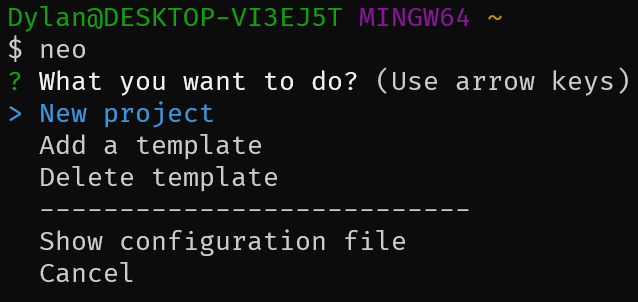

# Neopro

A fast, small and intuitive __CLI__ application for creating projects from pre-defined templates.

## Getting started

Install globally with _npm_.

```bash
npm i -g neoprojs
```

Now you have access to the `neo` command.

## Usage
After the installation, just type `neo` in your terminal and a list of options will appear:



### New project

In this option, you can start a project based on a predefined template.

By default, __Neopro__ comes with two templates: __Svelte basic__ and __Svelte with Tailwindcss__, but you can creating your own templates.

### Add a template

You can easily create your owns templates following a few steps.

1. Create your template project the way you want.
2. Upload to a __Github__ repositorie.
3. Type `neo` in your terminal and choose `Add a template`.
4. Choose a name for your template.
5. Add the __Github__ URL of your repositorie.

And is done!

### Delete template

To delete a template, you can just choose the `Delete template` option then select all templates that you want to delete.

### Configuration file

__Neopro__ stores a configuration file in your _home_ directory, called __neopro.config.json__. This file holds the references for your templates.

Choosing this option will open this file.